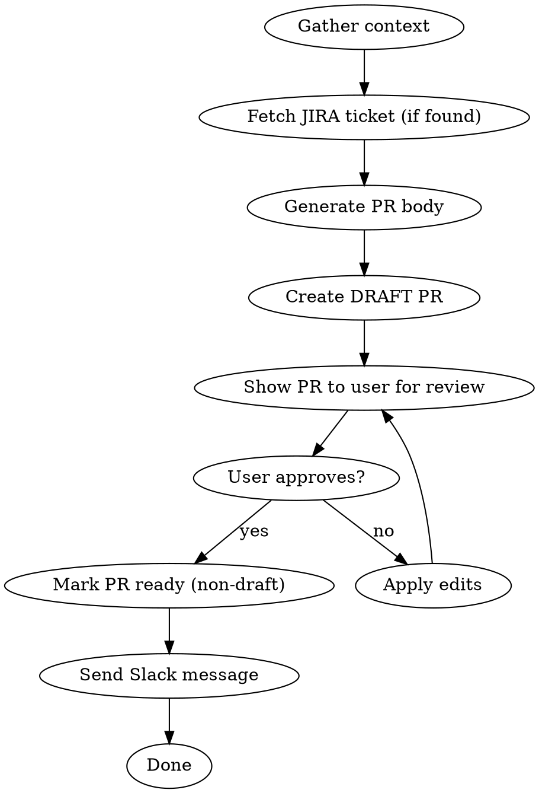

# Submit PR

Create a draft PR, get user approval on the body, mark it ready for review, and notify Slack.

## Constants

| Name | Value |
|------|-------|
| SLACK_CHANNEL_NAME | `#business-money-code-reviews` |
| SLACK_CHANNEL_ID | `C0AM3RB6753` |
| JIRA_SITE | `gustohq.atlassian.net` |
| JIRA_TICKET_URL_BASE | `https://gustohq.atlassian.net/browse/` |
| BRANCH_TICKET_PATTERN | Project prefix + number (e.g. `gm-12345-foo` → `GM-12345`) |

## Workflow



## Step 1: Gather Context

Run in parallel:
- `git merge-base main HEAD` — merge base between main and HEAD (use for diffs)
- `git log <merge-base>..HEAD --oneline` — commits on this branch
- For each commit:
    - `git show <commit> --stat` — files changed
    - `git show <commit>` — full diff
- `git diff <merge-base>...HEAD --stat` — summary of files changed
- `git diff <merge-base>...HEAD` — final diff to go in
- `git branch --show-current` — branch name (extract ticket if present)

**Ticket extraction:** Only extract a ticket ID if the branch matches **BRANCH_TICKET_PATTERN** (e.g. `gm-12345-foo` -> `GM-12345`). Branches like `gm-do-something` or `fix-widget` have no ticket — do not attempt a JIRA lookup for these.

## Step 2: Fetch JIRA Ticket (if ticket ID found)

If a ticket ID was extracted from the branch name (e.g. `GM-12345`):

Use the `mcp__jiraconfluencegusto__getJiraIssue` tool:
- `cloudId`: **JIRA_SITE**
- `issueIdOrKey`: the extracted ticket (e.g. `GM-12345`)
- `fields`: `["summary", "description", "status"]`
- `responseContentFormat`: `markdown`

Extract from the response:
- **Ticket summary** — the title/summary field
- **Ticket description** — the description field (may be long; distill to key points)

If the ticket lookup fails or no ticket ID was found, proceed without it — leave the "Why" section to be derived from commits/diff only.

## Step 3: Generate PR Body

Use the commits, summary diff, files changed, **and JIRA ticket details (if available)** to populate this template. **Remove all comments — replace with real content.**

```markdown
What is this change doing?
--------

- [bullet points summarizing changes, 1 sentence each]

Why is this change being made?
--------

[justification — combine JIRA ticket context with commit context. If a JIRA ticket was found, lead with the ticket's goal/purpose and add detail from the diff. If no ticket, derive from commits/diff.]

How did you test this change?
--------

Please describe explicitly the steps you took to test:
- [ ] Happy-Path: [describe expected success scenarios tested]

- [ ] Sad-Path: [describe error handling / edge cases tested]

## AI-Assisted Development

- [ ] This code was vibe-coded (AI-assisted)
- [ ] I've reviewed and tested the generated code
- [ ] Tests are passing locally

Related documentation:
--------

- Ticket: {JIRA_TICKET_URL_BASE}GM-XXXXX
- Tech Spec:
```

**Rules for populating:**
- "What is this change doing?" — if commits are clean, mirror them as bullets. If messy, generate from the diff.
- "Why is this change being made?" — if a JIRA ticket was found, use the ticket summary and description as the primary source for the justification. Supplement with detail from the diff. If no ticket, derive entirely from commits/diff.
- "Ticket" — extract from branch name (e.g. `gm-12345-*` -> `GM-12345`). If not found, leave `GM-XXXXX`.
- "Tech Spec" — leave blank.
- AI-assisted development box — ONLY tick if you were involved in the majority of the code generation in this PR - determine from session context or commit authorship
- Tests are passing locally box — ONLY tick if the tests are passing locally (based ONLY on your context, do NOT run tests here) -- if you're not sure, leave it unchecked and let the user confirm
- PR title — short (<70 chars), derived from the branch/work/JIRA ticket summary.

## Step 4: Create Draft PR

```bash
gh pr create --draft --title "<title>" --body "$(cat <<'EOF'
<generated body>
EOF
)"
```

Capture the PR URL and PR number from the output.

## Step 5: Show PR to User for Review

Display the full PR body and URL. PROMPT the user to open the PR in their browser, then run if approved:

```bash
open <PR_URL>
```

Ask the user whether to submit the PR for review, or to make further edits.

If you are asked to make further edits, remember to update the PR body with `gh pr edit <number> --body "..."` to match.

## Step 6: Mark Ready for Review

Once user approves:

```bash
gh pr ready <number>
```

## Step 7: Send Slack Notification

Send to **SLACK_CHANNEL_NAME** (channel ID: **SLACK_CHANNEL_ID**) using the Slack MCP tool. Use the channel ID directly; only fall back to searching for the channel by name if the ID fails. Message format:

```
:pr: <https://github.com/Gusto/zenpayroll/pull/NUMBER|PR Title>
A brief (2-to-3-sentence) description of the changes and why they're being made.
```

The description should be a concise plain-text summary — not the full PR body, just the essence of the change. **If a JIRA ticket was found, incorporate the ticket's purpose/goal into the summary** so reviewers understand the "why" at a glance.
